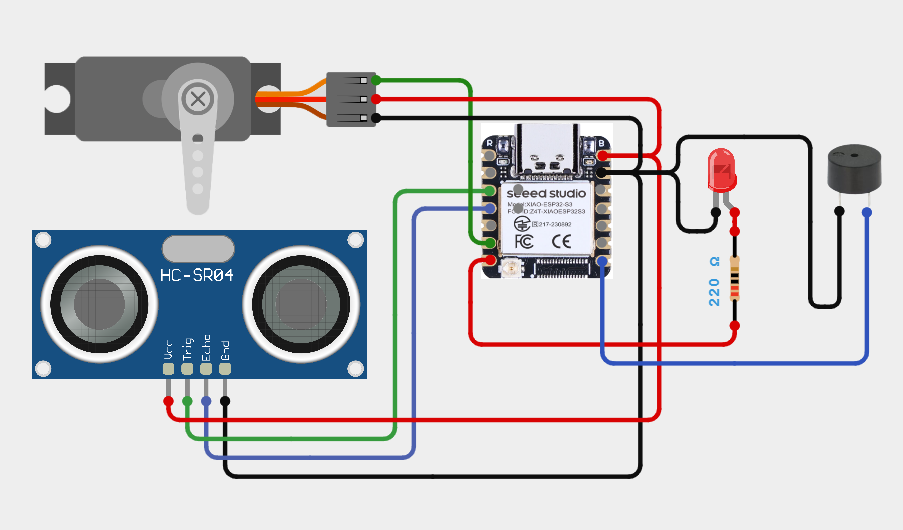

# XIAO-007-Servo-Obstacle-Avoider🤖
Create a mini radar that scans and detects obstacles! Using the XIAO ESP32-S3, a servo, and an ultrasonic sensor, it sweeps the area like real radar. When an object is detected, the LED lights up and the buzzer alerts instantly — all in a compact setup.

---

## 🛠️ Components Used

1. [XIAO ESP32 S3 Sense](https://robocraze.com/products/seeed-studio-xiao-esp32-s3-development-board-supports-wi-fi-bluetooth-5-0?_pos=1&_psq=XIAO+ESP32+S3&_ss=e&_v=1.0)
2. [SG90 Micro Servo Motor](https://robocraze.com/products/sg90-micro-servo-motor?_pos=1&_psq=Servo+motor+%28SG90%29&_ss=e&_v=1.0)
3. [HC-SR04 Ultrasonic Sensor](https://robocraze.com/products/hc-sr-04-ultrasonic-sensor?_pos=2&_psq=HC&_ss=e&_v=1.0)
4. [Red LED](https://robocraze.com/products/5mm-red-led-pack-of-11?_pos=2&_sid=50b0f0e3d&_ss=r)
5. [220Ω Resistor](https://robocraze.com/products/220-ohm-resistor-pack-of-10?_pos=1&_psq=220&_ss=e&_v=1.0)
6. [Active Buzzer](https://robocraze.com/products/9-volts-buzzer-small?_pos=1&_psq=BUZZER&_ss=e&_v=1.0)

---

## 🎥 Project Demo

📱 [Instagram Reel](https://www.instagram.com/reel/DRFOsqcE56t/?igsh=MXVyZHl2aWo0ODA0NA==)

---

## Circuit Diagram

---
